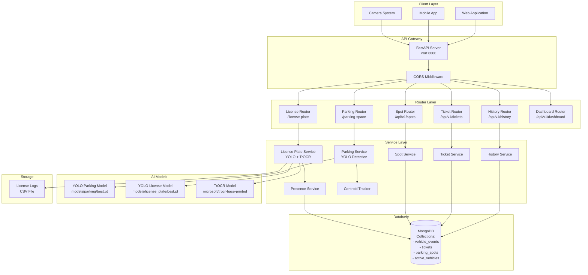
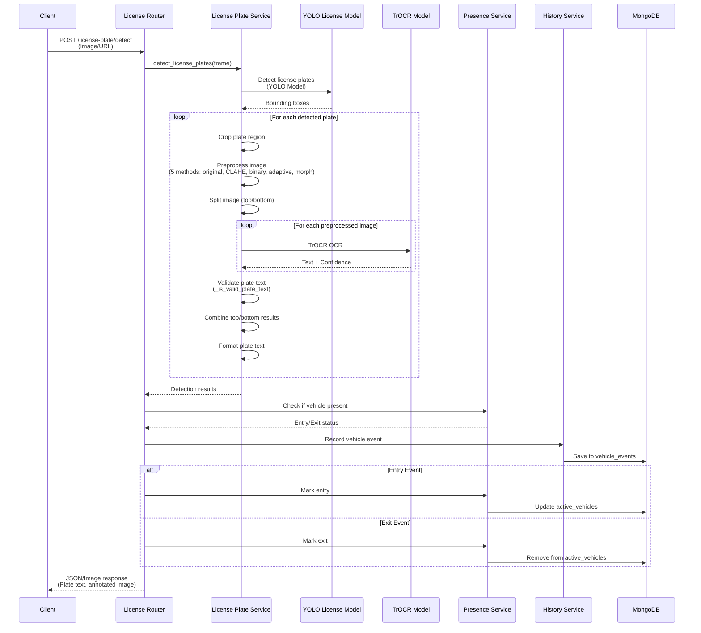
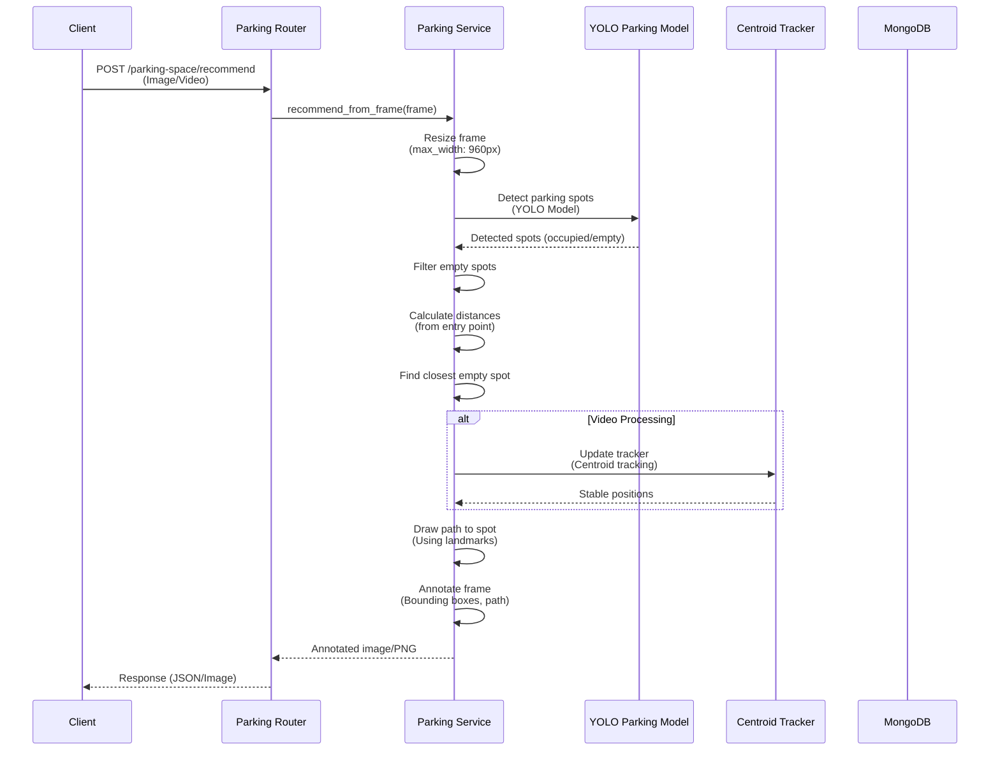
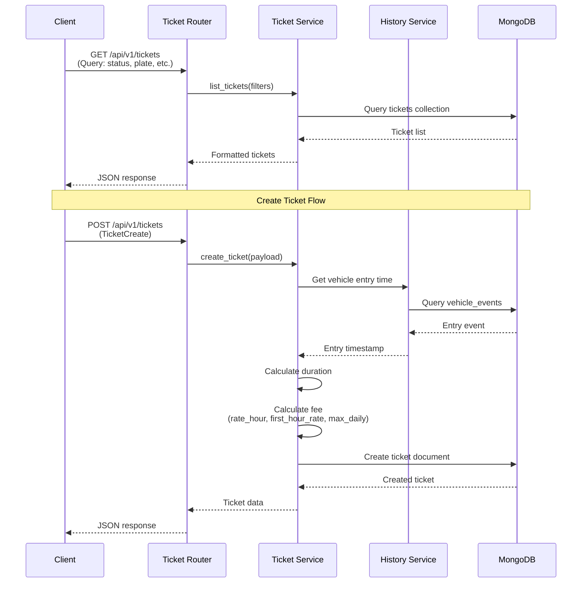
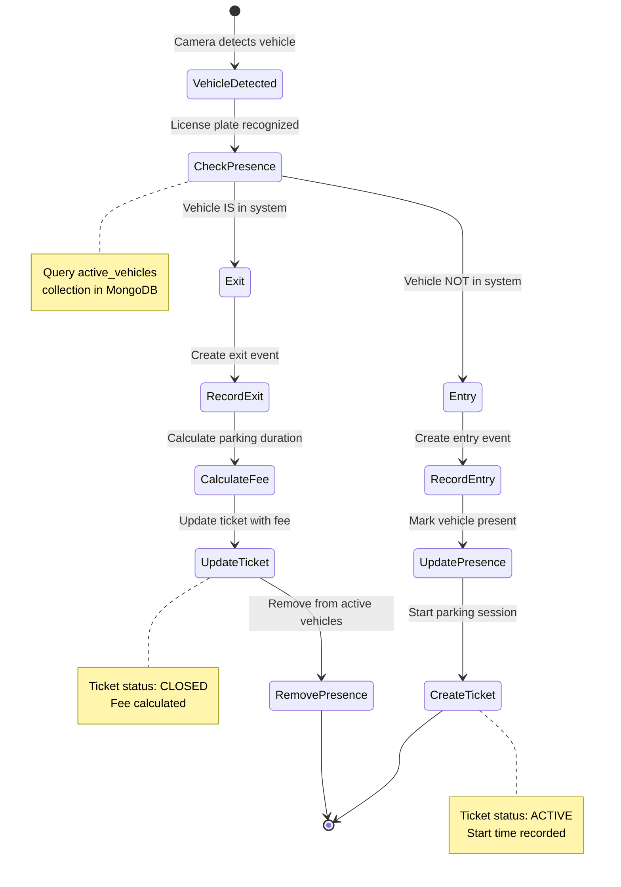
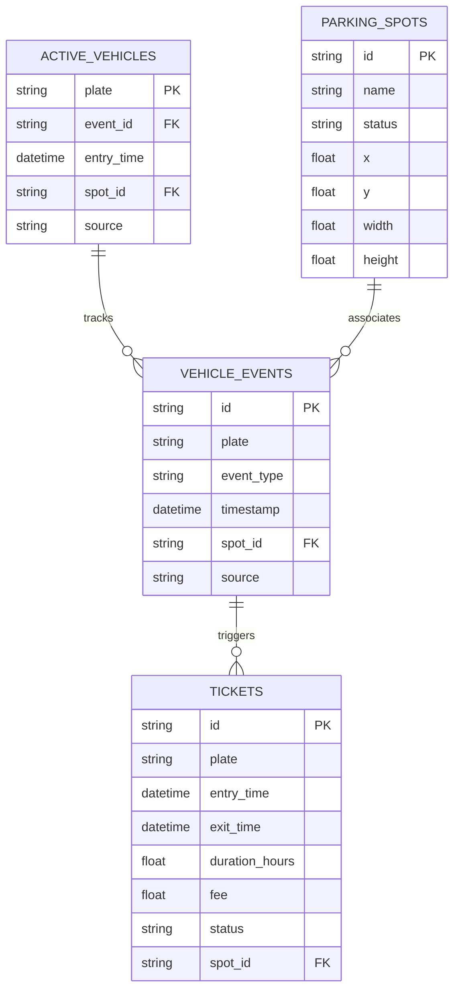
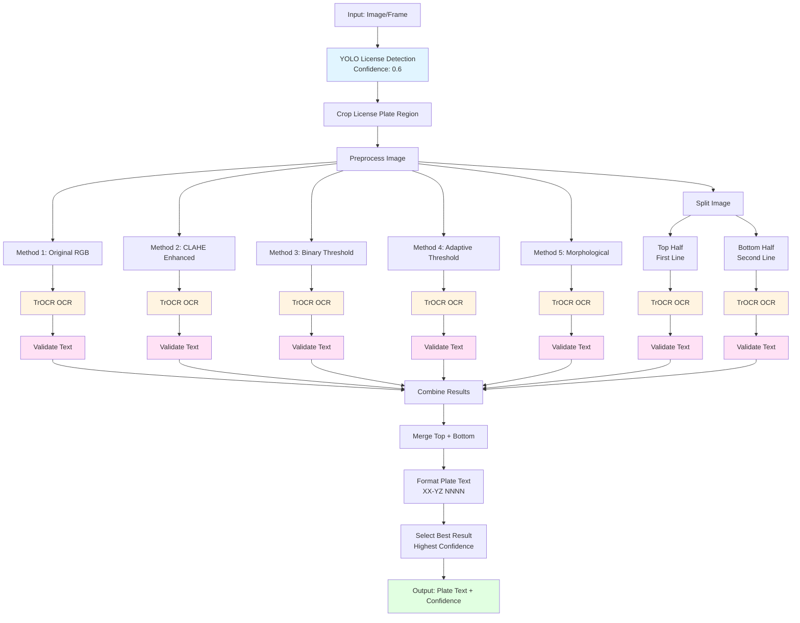
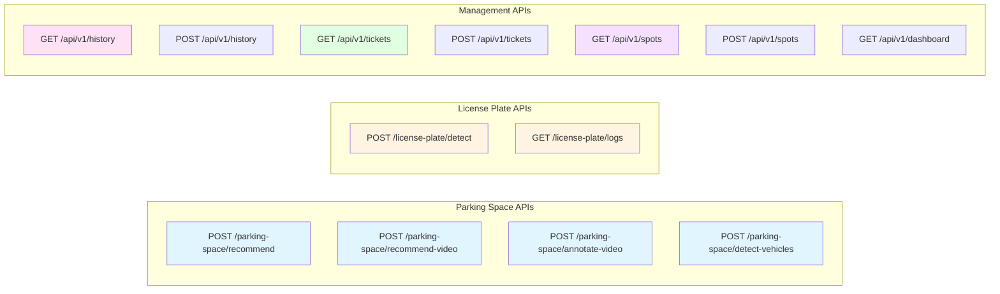

# Sơ Đồ Hệ Thống và Luồng Dữ Liệu - Smart Parking System

## 1. Kiến Trúc Hệ Thống Tổng Quan



## 2. Luồng Dữ Liệu - License Plate Detection



## 3. Luồng Dữ Liệu - Parking Space Recommendation



## 4. Luồng Dữ Liệu - Ticket Management



## 5. Luồng Dữ Liệu - Vehicle Entry/Exit



## 6. Cấu Trúc Dữ Liệu MongoDB



## 7. Chi Tiết License Plate Detection Pipeline



## 8. API Endpoints Overview



## 9. Technology Stack

```
┌─────────────────────────────────────────┐
│         Client Applications              │
│  (Web, Mobile, Camera Systems)          │
└─────────────────┬───────────────────────┘
                  │ HTTP/REST
┌─────────────────▼───────────────────────┐
│         FastAPI Backend                  │
│  - Python 3.13                           │
│  - FastAPI Framework                     │
│  - Uvicorn ASGI Server                   │
└─────────────────┬───────────────────────┘
                  │
    ┌─────────────┼─────────────┐
    │             │             │
┌───▼───┐   ┌────▼────┐   ┌────▼────┐
│ YOLO  │   │  TrOCR  │   │ MongoDB │
│ Models│   │  Model  │   │ Database│
└───────┘   └─────────┘   └─────────┘
    │             │             │
    │             │             │
┌───▼─────────────▼─────────────▼───┐
│      AI/ML Models                 │
│  - YOLOv8 (Ultralytics)           │
│  - TrOCR (Microsoft)              │
│  - PyTorch                        │
└───────────────────────────────────┘
```

## 10. Data Flow Summary

### License Plate Detection Flow:
1. **Input**: Image/Video frame → FastAPI Router
2. **Detection**: YOLO detects license plate regions
3. **OCR**: TrOCR reads text from each detected region
4. **Validation**: Filter invalid results
5. **Storage**: Save to MongoDB (vehicle_events, active_vehicles)
6. **Output**: Annotated image + plate text

### Parking Recommendation Flow:
1. **Input**: Image/Video → FastAPI Router
2. **Detection**: YOLO detects parking spots (occupied/empty)
3. **Analysis**: Calculate distances, find closest empty spot
4. **Tracking**: Centroid tracker for video processing
5. **Visualization**: Draw path and annotate frame
6. **Output**: Annotated image with recommendation

### Ticket Management Flow:
1. **Entry**: Vehicle detected → Create entry event → Start ticket
2. **Tracking**: Monitor active vehicles in MongoDB
3. **Exit**: Vehicle exits → Calculate duration → Calculate fee
4. **Storage**: Save ticket with fee to MongoDB
5. **Query**: Retrieve tickets by status, plate, date range

---

**Ghi chú**: 
- Tất cả các sơ đồ được tạo bằng Mermaid syntax
- Có thể render trên GitHub, GitLab, hoặc các Markdown viewer hỗ trợ Mermaid
- Để xem trực quan, sử dụng: https://mermaid.live/

